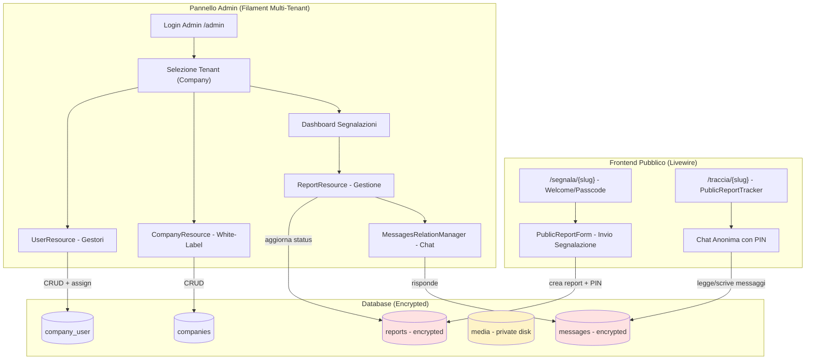
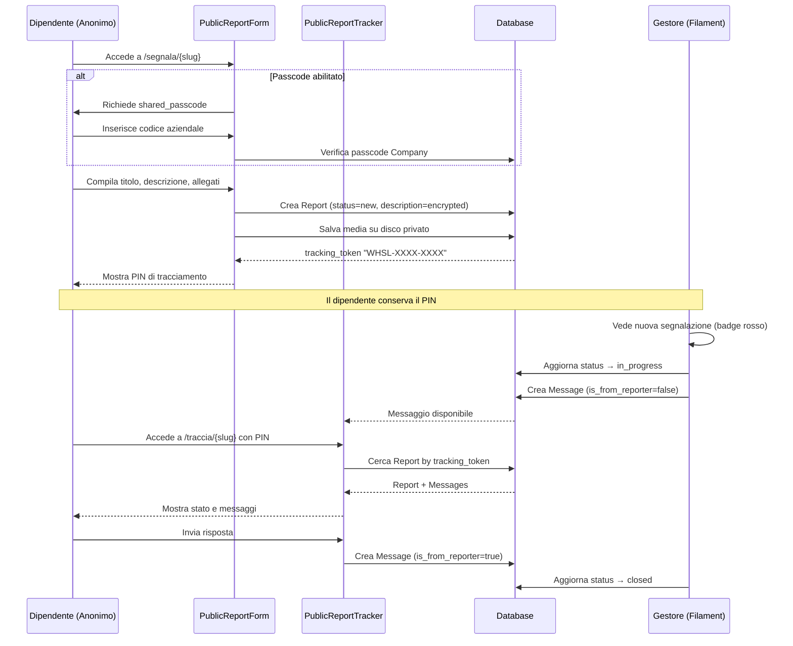
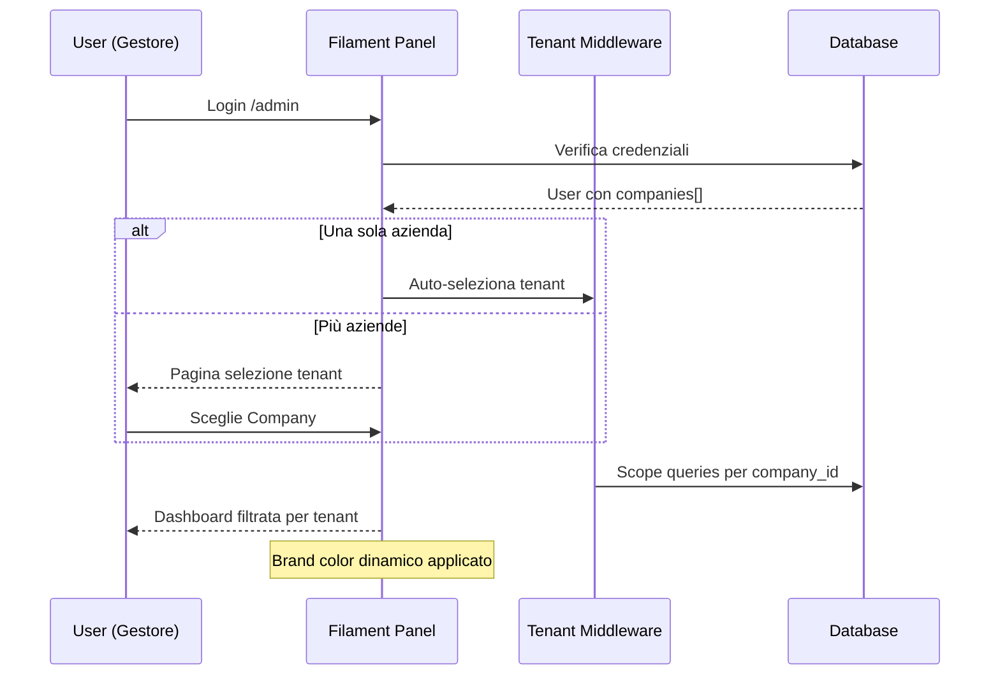

# Design Document: Whistleblowing Platform

## Overview

Piattaforma SaaS multi-tenant per la gestione di segnalazioni anonime (whistleblowing) conforme alla Direttiva UE 2019/1937. Ogni azienda cliente ottiene un portale white-label con URL dedicato, form anonimo per i dipendenti, e pannello di gestione per i responsabili compliance. Il sistema è costruito su Laravel 12 + Filament 5 con crittografia end-to-end dei contenuti sensibili e audit trail immutabile.

La piattaforma copre l'intero ciclo di vita di una segnalazione: dalla sottomissione anonima da parte del dipendente, alla gestione investigativa da parte del gestore aziendale, fino alla chiusura con comunicazione bidirezionale cifrata. Le funzionalità commentate nel codice attuale (multi-tenancy Filament, brand color dinamico, passcode di sblocco, QR code) devono essere completate e integrate.

## Architettura



## Flusso Principale: Ciclo di Vita di una Segnalazione



## Flusso Multi-Tenancy Filament



## Componenti e Interfacce

### Componente 1: PublicReportForm (Livewire)

**Scopo**: Form anonimo per la sottomissione di segnalazioni da parte dei dipendenti.

**Interfaccia**:
```php
class PublicReportForm extends Component implements HasForms
{
    public Company $company;
    public ?array $data = [];
    public bool $isSubmitted = false;
    public string $trackingPin = '';
    public bool $passcodeVerified = false;  // NUOVO: stato verifica passcode
    public string $passcodeInput = '';       // NUOVO: input passcode

    public function mount(Company $company): void;
    public function form(Form $form): Form;
    public function verifyPasscode(): void;  // NUOVO
    public function submit(): void;
    public function render(): View;
}
```

**Responsabilità**:
- Verificare il passcode aziendale se `company->shared_passcode` è impostato
- Raccogliere titolo, descrizione e allegati in modo anonimo
- Generare PIN univoco formato `WHSL-XXXX-XXXX`
- Salvare il report con `description` cifrata
- Salvare allegati su disco `private` via Spatie Media Library
- Mostrare schermata di conferma con PIN dopo l'invio

### Componente 2: PublicReportTracker (Livewire)

**Scopo**: Portale di tracciamento per il segnalante anonimo tramite PIN.

**Interfaccia**:
```php
class PublicReportTracker extends Component
{
    public string $pin = '';
    public ?Report $report = null;
    public string $newMessage = '';
    public string $errorMessage = '';

    public function accessReport(): void;
    public function sendMessage(): void;
    public function render(): View;
}
```

**Responsabilità**:
- Autenticare il segnalante tramite PIN (tracking_token)
- Mostrare lo stato corrente della segnalazione
- Visualizzare la cronologia messaggi cifrati
- Permettere l'invio di nuovi messaggi (`is_from_reporter = true`)

### Componente 3: AdminPanelProvider (Filament Multi-Tenant)

**Scopo**: Configurazione del pannello Filament con multi-tenancy per Company.

**Interfaccia**:
```php
class AdminPanelProvider extends PanelProvider
{
    public function panel(Panel $panel): Panel
    {
        return $panel
            ->tenant(Company::class, slugAttribute: 'slug')
            ->tenantMenu(true)
            ->colors(['primary' => fn() => Filament::getTenant()?->brand_color ?? '#1d4ed8'])
            // ...
    }
}
```

**Responsabilità**:
- Abilitare il tenant scope su Company
- Applicare brand color dinamico per tenant
- Filtrare automaticamente tutte le query per `company_id`
- Gestire la selezione del tenant al login

### Componente 4: ReportResource (Filament)

**Scopo**: Gestione delle segnalazioni ricevute nel pannello admin.

**Interfaccia**:
```php
class ReportResource extends Resource
{
    public static function canCreate(): bool { return false; }
    public static function getRelations(): array {
        return [MessagesRelationManager::class];  // DA REGISTRARE
    }
}
```

**Responsabilità**:
- Listare segnalazioni filtrate per tenant corrente
- Permettere la modifica dello stato (new → in_progress → closed)
- Visualizzare contenuto cifrato in chiaro (Laravel gestisce il decrypt)
- Permettere download allegati da disco privato
- Integrare la chat via MessagesRelationManager

### Componente 5: MessagesRelationManager (Filament)

**Scopo**: Chat bidirezionale integrata nella pagina di gestione report.

**Responsabilità**:
- Mostrare cronologia messaggi ordinata per data
- Permettere al gestore di rispondere (`is_from_reporter = false`)
- Impedire modifica/cancellazione messaggi (audit trail)
- Forzare `is_from_reporter = false` via `mutateFormDataUsing`

### Componente 6: CompanyResource (Filament)

**Scopo**: CRUD aziende clienti con configurazione white-label.

**Responsabilità**:
- Gestire nome, slug, logo, brand_color, shared_passcode
- Auto-generare slug da nome azienda
- Generare QR code per il link di segnalazione
- Mostrare link copiabile e codice accesso

## Modelli Dati

### Company

```php
// Migration: companies
Schema::create('companies', function (Blueprint $table) {
    $table->id();
    $table->string('name');
    $table->string('slug')->unique();
    $table->string('logo_path')->nullable();
    $table->string('brand_color')->default('#1d4ed8');
    $table->string('shared_passcode')->nullable();
    $table->timestamps();
});

// Model
class Company extends Model implements HasAvatar
{
    protected $fillable = ['name', 'slug', 'logo_path', 'brand_color', 'shared_passcode'];

    public function users(): BelongsToMany;   // Gestori assegnati
    public function reports(): HasMany;        // Segnalazioni ricevute
    public function getFilamentAvatarUrl(): ?string;
}
```

**Regole di validazione**:
- `slug` deve essere unico e URL-safe
- `brand_color` deve essere un colore HEX valido
- `shared_passcode` opzionale; se presente, blocca il form pubblico

### Report

```php
// Migration: reports
Schema::create('reports', function (Blueprint $table) {
    $table->id();
    $table->foreignId('company_id')->constrained()->cascadeOnDelete();
    $table->string('tracking_token')->unique();  // WHSL-XXXX-XXXX
    $table->string('status')->default('new');    // new|in_progress|closed
    $table->string('title');
    $table->text('description');                 // encrypted at rest
    $table->timestamps();
});

// Model
class Report extends Model implements HasMedia
{
    use InteractsWithMedia;

    protected function casts(): array {
        return ['description' => 'encrypted'];
    }

    public function company(): BelongsTo;
    public function messages(): HasMany;
    public function registerMediaCollections(): void;  // collection 'evidence', disk 'private'
}
```

**Regole di validazione**:
- `tracking_token` univoco, generato automaticamente
- `status` enum: `new`, `in_progress`, `closed`
- `description` cifrata con `APP_KEY` Laravel
- Allegati su disco `private`, max 5 file, max 10MB ciascuno

### Message

```php
// Migration: messages
Schema::create('messages', function (Blueprint $table) {
    $table->id();
    $table->foreignId('report_id')->constrained()->cascadeOnDelete();
    $table->text('body');                        // encrypted at rest
    $table->boolean('is_from_reporter')->default(false);
    $table->timestamps();
});

// Model
class Message extends Model
{
    protected function casts(): array {
        return [
            'body' => 'encrypted',
            'is_from_reporter' => 'boolean',
        ];
    }

    public function report(): BelongsTo;
}
```

**Invarianti di integrità**:
- Nessuna `EditAction` o `DeleteAction` (audit trail legale)
- `is_from_reporter` impostato lato server, mai dal form

### User

```php
class User extends Authenticatable
{
    protected $fillable = ['name', 'email', 'password'];

    public function companies(): BelongsToMany;  // Aziende gestite

    // Filament: accesso al pannello solo se assegnato ad almeno una company
    public function canAccessPanel(Panel $panel): bool;
}
```

## Routing Pubblico

```php
// routes/web.php
Route::get('/segnala/{company:slug}', [PublicController::class, 'welcome'])
    ->name('report.welcome');

Route::get('/segnala/{company:slug}/form', PublicReportForm::class)
    ->name('report.form');

Route::get('/traccia/{company:slug}', PublicReportTracker::class)
    ->name('report.track');
```

**Nota**: Le route pubbliche usano `{company:slug}` per il route model binding tramite slug.

## Algoritmi Chiave con Specifiche Formali

### Algoritmo 1: Generazione PIN Univoco

```pascal
ALGORITHM generateTrackingPin()
OUTPUT: pin of type String (format "WHSL-XXXX-XXXX")

BEGIN
  REPEAT
    segment1 ← strtoupper(Str::random(4))
    segment2 ← strtoupper(Str::random(4))
    pin ← "WHSL-" + segment1 + "-" + segment2
  UNTIL NOT Report::where('tracking_token', pin)->exists()

  RETURN pin
END
```

**Precondizioni**: Database accessibile
**Postcondizioni**: PIN restituito è univoco nel database
**Invariante**: Il formato è sempre `WHSL-[A-Z0-9]{4}-[A-Z0-9]{4}`

### Algoritmo 2: Verifica Passcode Aziendale

```pascal
ALGORITHM verifyPasscode(company, inputPasscode)
INPUT: company of type Company, inputPasscode of type String
OUTPUT: isValid of type Boolean

BEGIN
  IF company.shared_passcode IS NULL OR company.shared_passcode IS EMPTY THEN
    RETURN true  // Nessun passcode richiesto
  END IF

  IF inputPasscode EQUALS company.shared_passcode THEN
    RETURN true
  ELSE
    RETURN false
  END IF
END
```

**Precondizioni**: `company` è un record valido
**Postcondizioni**: Restituisce `true` se il form è accessibile, `false` altrimenti

### Algoritmo 3: Scope Multi-Tenant

```pascal
ALGORITHM applyTenantScope(query, currentTenant)
INPUT: query of type Builder, currentTenant of type Company|null
OUTPUT: scopedQuery of type Builder

BEGIN
  IF currentTenant IS NULL THEN
    RETURN query  // Super-admin: nessun filtro
  END IF

  RETURN query.where('company_id', currentTenant.id)
END
```

**Precondizioni**: Filament tenant middleware attivo
**Postcondizioni**: Ogni query su Report è filtrata per `company_id`
**Invariante**: Un gestore non può mai vedere segnalazioni di altre aziende

### Algoritmo 4: Invio Messaggio dal Gestore

```pascal
ALGORITHM sendManagerMessage(report, messageBody)
INPUT: report of type Report, messageBody of type String
OUTPUT: message of type Message

BEGIN
  ASSERT report IS NOT NULL
  ASSERT messageBody IS NOT EMPTY

  message ← new Message()
  message.report_id ← report.id
  message.body ← messageBody        // Cifrato automaticamente dal cast
  message.is_from_reporter ← false  // SEMPRE false per il gestore

  message.save()

  ASSERT message.id IS NOT NULL
  ASSERT message.is_from_reporter EQUALS false

  RETURN message
END
```

**Precondizioni**: `report` esiste, `messageBody` non vuoto
**Postcondizioni**: Messaggio salvato con `is_from_reporter = false`, body cifrato
**Invariante**: `is_from_reporter` non può essere modificato dopo la creazione

## Gestione Errori

### Scenario 1: PIN Non Trovato

**Condizione**: Il segnalante inserisce un PIN inesistente in PublicReportTracker
**Risposta**: Messaggio di errore "PIN non valido o segnalazione inesistente"
**Recovery**: Il form rimane attivo per un nuovo tentativo

### Scenario 2: Passcode Errato

**Condizione**: Il dipendente inserisce un passcode sbagliato
**Risposta**: Errore di validazione Livewire, form non sbloccato
**Recovery**: Possibilità di reinserire il codice

### Scenario 3: Slug Azienda Non Trovato

**Condizione**: URL `/segnala/{slug}` con slug inesistente
**Risposta**: Laravel 404 via route model binding
**Recovery**: Pagina 404 personalizzata

### Scenario 4: Upload File Fallito

**Condizione**: File troppo grande o tipo non supportato
**Risposta**: Validazione Filament Forms con messaggio specifico
**Recovery**: L'utente può rimuovere il file e riprovare

### Scenario 5: Tenant Non Assegnato

**Condizione**: Gestore tenta di accedere al pannello senza aziende assegnate
**Risposta**: Redirect alla pagina di selezione tenant vuota
**Recovery**: Un super-admin deve assegnare l'utente ad almeno una Company

## Strategia di Testing

### Unit Testing

- Generazione PIN: verifica unicità e formato `WHSL-XXXX-XXXX`
- Verifica passcode: casi con passcode null, corretto, errato
- Cifratura: verifica che `description` e `body` siano cifrati nel DB
- Scope tenant: verifica che le query siano filtrate per `company_id`

### Property-Based Testing

**Libreria**: PHPUnit con dataset providers

**Proprietà da testare**:
- Per qualsiasi slug valido, il route model binding restituisce la Company corretta
- Per qualsiasi PIN generato, il formato è sempre `WHSL-[A-Z0-9]{4}-[A-Z0-9]{4}`
- Per qualsiasi messaggio salvato dal gestore, `is_from_reporter` è sempre `false`
- Per qualsiasi report, `description` nel DB non contiene mai testo in chiaro

### Integration Testing

- Flusso completo: invio segnalazione → ricezione PIN → tracciamento → chat
- Multi-tenancy: gestore A non vede report di gestore B
- Media Library: allegati salvati su disco `private`, non accessibili pubblicamente
- QR Code: generazione corretta per ogni slug aziendale

## Considerazioni di Sicurezza

- **Crittografia at rest**: `description` (Report) e `body` (Message) usano il cast `encrypted` di Laravel, cifrati con `APP_KEY`
- **Disco privato**: Gli allegati sono su disco `private`, non serviti direttamente dal web server
- **Audit trail**: Nessuna `EditAction`/`DeleteAction` sui messaggi; nessuna `DeleteBulkAction` sui report
- **Anonimato**: Il form pubblico non richiede autenticazione; nessun dato personale obbligatorio
- **Tenant isolation**: Il middleware Filament garantisce che ogni gestore veda solo i dati della propria Company
- **Passcode**: Il `shared_passcode` è un layer opzionale per limitare l'accesso al form ai soli dipendenti
- **canCreate=false**: I report non possono essere creati manualmente dal pannello admin
- **CSRF**: Tutti i form Livewire sono protetti da CSRF token automaticamente

## Considerazioni di Performance

- **Eager loading**: `Report::with('messages', 'media')` per evitare N+1 nelle liste
- **Paginazione**: Filament gestisce la paginazione automaticamente nelle tabelle
- **Media Library**: Gli allegati sono referenziati via DB, non caricati in memoria
- **QR Code**: Generato on-demand nella modal, non pre-generato

## Dipendenze

| Pacchetto | Versione | Scopo |
|-----------|----------|-------|
| `filament/filament` | ^5.3 | Pannello admin + form + tabelle |
| `filament/spatie-laravel-media-library-plugin` | ^5.3 | Upload allegati in Filament |
| `spatie/laravel-medialibrary` | ^11.21 | Gestione media con disco privato |
| `simplesoftwareio/simple-qrcode` | ^4.2 | Generazione QR code per slug |
| `barryvdh/laravel-dompdf` | ^3.1 | Export PDF (futuro) |
| `laravel/framework` | ^12.0 | Framework base |

## Funzionalità da Completare (Gap Analysis)

Le seguenti funzionalità sono presenti nel codice ma commentate o non collegate:

| Funzionalità | File | Stato | Azione Richiesta |
|---|---|---|---|
| Multi-tenancy Filament | `AdminPanelProvider.php` | Commentato | Decommentare `->tenant(Company::class)` e configurare |
| Brand color dinamico | `AdminPanelProvider.php` | Commentato | Decommentare `->colors([...])` con closure |
| MessagesRelationManager | `ReportResource.php` | Non registrato | Aggiungere a `getRelations()` |
| Passcode sblocco form | `PublicReportForm.php` | Non implementato | Aggiungere step verifica passcode |
| Route pubbliche | `routes/web.php` | Da verificare | Assicurare route per slug e tracker |
| `canAccessPanel` su User | `User.php` | Mancante | Aggiungere metodo con check companies |
| Media collection 'evidence' | `Report.php` | Mancante | Aggiungere `registerMediaCollections()` |
